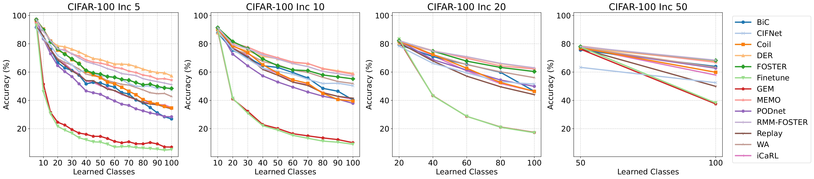

# CIFNet: Class Incremental Frugal Network

[](https://arxiv.org/abs/2509.11285)
[](https://github.com/AlejandroDopico2/CIFNet/blob/main/LICENSE)

[](https://pytorch.org/)


**CIFNet (Class Incremental Frugal Network)** is an efficient approach to **Class Incremental Learning (CIL)** that achieves state-of-the-art accuracy while drastically reducing training time and energy consumption. It is designed for resource-constrained environments such as edge devices, where computational efficiency is critical.

CIFNet introduces a **single-step optimization** process and a **compressed buffer** mechanism that stores condensed representations of previous data samples, minimizing both computation and memory usage.

---

> 🏆 **This work was developed as part of my Master’s Thesis** in the [Master in Artificial Intelligence at the University of A Coruña (MIA-UDC)](https://mia.udc.es).  
> It was awarded **Best Master’s Thesis in Artificial Intelligence (2025)** by the [AEPIA](https://aepia.org) (Spanish Association for Artificial Intelligence) at the **EVIA Summer School on AI 2025**.

---

## 🚀 Key Features
- ⚡ **Single-Step Training** — Avoids multiple training epochs to reduce compute time.
- 🧠 **Compressed Buffer** - Stores low-dimensional representations, minimizing memory footprint.
- 🧩 **Resistant to Forgetting** — Maintains accuracy on past classes without complex regularization.
- 🌱 **Energy Efficient** - Optimized for low-resource and real-time applications.


## 🛠️ Installation

### Prerequisites
- Python ≥ 3.9
- PyTorch ≥ 2.7.1
- Other dependencies listed in `requirements.txt`

### Setup
1. Clone the repository:
   ```bash
   git clone https://github.com/AlejandroDopico2/CIFNet.git
   cd CIFNet
   ```

2. Install the required dependencies:
   ```bash
   pip install -r requirements.txt
   ```

3. Download datasets:
   - **MNIST** and **CIFAR** datasets are automatically downloaded via `torchvision`.
   - For **ImageNet**, download the dataset manually and place it in the `tiny-imagenet` or `imagenet-100` directory.

## 🧩 Usage

### Training
```bash
python main.py -p cfgs/CIFAR10_random.yaml
```
Configuration files are available in the `cfgs/` directory.
Modify YAML files to customize hyperparameters and dataset paths.

### Example Configuration Files
- `CIFAR10_random.yaml`: for CIFAR-10
- `CIFAR100_random.yaml`: for CIFAR-100
- `ImageNet100_random.yaml`: for ImageNet-100

## 📊 Results

CIFNet achieves competitive accuracy while significantly reducing training time and energy consumption.

**Performance on CIFAR-100**
<div align="center">
  
</div>

**Performance on ImageNet-100**
<div align="center">
  
</div>

**Results for 20 tasks config**:

| Dataset       | Accuracy | Training Time | Energy Consumption |
|---------------|----------|---------------|--------------------|
| CIFAR-100     | 59.26%   | 15 min.       | 0.063 kWh          |
| ImageNet-100  | 78.10%   | 71 min.       | 0.271 kWh          |

**Sustainable Metrics Comparison (ImageNet-100 T=20)**
<div align="center">
  
</div>

For detailed experiments and ablation studies, see the [paper on arXiv](https://www.arxiv.org/abs/2509.11285).

## 🤝 Contributing

Contributions are welcome!
To contribute:
1. Fork the repository.
2. Create a new branch for your feature or bugfix.
3. Follow **PEP-8** coding standards.
4. Submit a pull request with a clear description of your changes.

To report bugs or request features, open an issue in this repository.

## 📚 Citation

If you use CIFNet in your research, please cite:
```latex
@misc{dopicocastro2025efficientsinglestepframeworkincremental,
      title={Efficient Single-Step Framework for Incremental Class Learning in Neural Networks}, 
      author={Alejandro Dopico-Castro and Oscar Fontenla-Romero and Bertha Guijarro-Berdiñas and Amparo Alonso-Betanzos},
      year={2025},
      eprint={2509.11285},
      archivePrefix={arXiv},
      primaryClass={cs.LG},
      url={https://arxiv.org/abs/2509.11285}, 
}
```

## 🧑‍💻 Authors

- **Alejandro Dopico Castro** - [GitHub](https://github.com/AlejandroDopico2)
- **Óscar Fontenla Romero**
- **Bertha Guijarro Berdiñas**
- **Amparo Alonso Betanzos**

## License

This project is licensed under the **MIT License**. See the [LICENSE](LICENSE) file for details.

## 🧭 Future Work

- Federated Learning adaptation
- Support for dynamic class addition
- Extended experiments on TinyImageNet