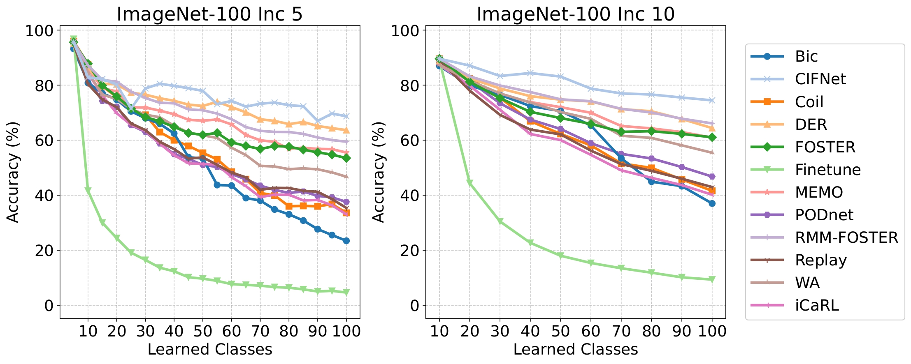

# CIFNet: Class and Incremental Frugal Network

[](https://github.com/AlejandroDopico2/CIFNet/blob/main/LICENSE)

[](https://pytorch.org/)


CIFNet (Class and Incremental Frugal Network) is an efficient approach to **Class Incremental Learning (CIL)** that achieves state-of-the-art accuracy while significantly reducing training time and energy consumption. Designed for resource-constrained environments, CIFNet is particularly suitable for edge devices where computational efficiency is critical.

The method introduces a **single-step optimization process** and a **compressed buffer mechanism** that stores condensed representations of previous data samples, drastically reducing memory requirements. Unlike traditional methods that require multiple training iterations, CIFNet achieves optimal performance in a single pass, making it ideal for real-time applications. CIFNet is particularly well-suited for applications in **edge computing**, where rapid adaptation to new classes and efficient resource utilization are essential.

## Key Features
- **Efficient Single-Step Training**: Reduces computational overhead by avoiding multiple training epochs.
- **Compressed Buffer**: Stores condensed representations of previous data, minimizing memory usage.
- **Mitigates Catastrophic Forgetting**: Maintains high accuracy on previously learned classes without complex regularization schemes.
- **Energy-Efficient**: Designed for low-resource environments, such as edge devices.


## Installation

### Prerequisites
- Python 3.9
- PyTorch
- Other dependencies listed in `requirements.txt`

### Setup
1. Clone the repository:
   ```bash
   git clone https://github.com/AlejandroDopico2/CIFNet.git
   cd CIFNet
   ```

2. Install the required dependencies:
   ```bash
   pip install -r requirements.txt
   ```

3. Download datasets:
   - **MNIST** and **CIFAR** datasets are automatically downloaded via `torchvision`.
   - For **ImageNet**, download the dataset manually and place it in the `tiny-imagenet` or `imagenet-100` directory.

## Usage

### Training
To train the model, use the following command:
```bash
python main.py -p cfgs/CIFAR10_random.yaml
```
Configuration files for different datasets are located in the `cfgs` directory. Modify the YAML files to adjust hyperparameters and dataset paths.

### Example Configuration Files
- `CIFAR10_random.yaml`: Configuration for CIFAR-10 dataset.
- `CIFAR100_random.yaml`: Configuration for CIFAR-100 dataset.
- `ImageNet100_random.yaml`: Configuration for ImageNet-100 dataset.

## Results

CIFNet achieves competitive accuracy while significantly reducing training time and energy consumption. Below are some key results:

**Performance on CIFAR-100**
<div align="center">
  
</div>

**Performance on ImageNet-100**
<div align="center">
  
</div>

| Dataset       | Accuracy | Training Time | Energy Consumption |
|---------------|----------|---------------|--------------------|
| CIFAR-100     | 47.51%   | 15 minutes    | 0.066 kWh          |
| ImageNet-100  | 68.70%   | 80 minutes    | 0.304 kWh          |

For more detailed results, refer to the experimental evaluation section in the paper (TODO: Add link to paper).

## Contributing

We welcome contributions! If you'd like to contribute to CIFNet, please follow these steps:
1. Fork the repository.
2. Create a new branch for your feature or bugfix.
3. Ensure your code follows **PEP-8** guidelines.
4. Submit a pull request with a detailed description of your changes.

To report issues or request features, please open an issue on the GitHub repository.

## License

This project is licensed under the **MIT License**. See the [LICENSE](LICENSE) file for details.

## Authors

- **Alejandro Dopico Castro** - [GitHub](https://github.com/AlejandroDopico2)
- **Óscar Fontenla Romero**
- **Bertha Guijarro Berdiñas**
- **Amparo Alonso Betanzos**

## TODO

- **Federated Learning Version**: Future work will focus on adapting CIFNet for federated learning environments.
- **Paper Link**: Add a link to the detailed paper once published.
- **New Class Integration**: Add documentation on how to train the model with new data or classes.